# API·이벤트 계약 기반 설계

**이슈:** #18

**목표:** 인증·달력·Task·Activity 구현 전에 REST와 이벤트의 단일 기준을 만들고, Java·TypeScript 생성물과 실제 직렬화 결과가 그 기준에서 벗어나지 않게 한다.

**기준 문서:** `docs/PRD.md`, `docs/plans/2026-09-01-mvp-implementation-plan.md`

## 범위

- planner·activity OpenAPI v1 원본
- 공통 Problem Details 스키마
- Spring interface·DTO와 TypeScript Fetch client 생성
- 핵심 도메인 이벤트 v1 JSON Schema와 정상·오류 fixture
- Java record 직렬화·JSON Schema 계약 테스트
- 생성 결과 drift와 계약 검증 CI

## 비범위

- 인증·Task·Activity 업무 로직과 실제 endpoint 구현
- DB entity·repository·migration
- Kafka producer·consumer와 Debezium
- 알림·운동 프로그램·공부 템플릿의 전체 API
- Schema Registry

## 설계 원칙

1. `contracts/` 아래 원본 계약을 단일 기준으로 사용한다.
2. 생성 코드는 직접 수정하지 않고 원본 계약이나 생성 설정을 변경한 뒤 다시 생성한다.
3. 생성 결과는 저장소에 포함해 Pull Request에서 계약 변화가 보이게 한다.
4. 기존 v1 계약의 파괴적 변경 대신 새 API 또는 이벤트 version을 추가한다.
5. 업무 로직은 생성 interface를 구현하고 생성 DTO를 경계에서만 사용한다.
6. 날짜는 `YYYY-MM-DD`, 시각은 UTC RFC 3339, 식별자는 UUID 문자열로 고정한다.

## 디렉터리 구조

```text
contracts/
  openapi/
    common-v1.yaml
    planner-v1.yaml
    activity-v1.yaml
  generator/
    planner-spring.yaml
    activity-spring.yaml
    planner-typescript.yaml
    activity-typescript.yaml
  events/
    envelope/v1.schema.json
    task-scheduled/v1.schema.json
    task-changed/v1.schema.json
    activity-completed/v1.schema.json
    activity-voided/v1.schema.json
  fixtures/
    events/<event>/v1-valid.json
    events/<event>/v1-invalid.json

services/planner-service/src/generated/java/
services/activity-service/src/generated/java/
packages/api-client/src/generated/planner/
packages/api-client/src/generated/activity/
```

## 한눈에 보는 계약 흐름



- 위쪽 흐름은 OpenAPI 원본과 생성 설정으로 Java API·DTO와 TypeScript client를 만들고 각 서비스와 React가 사용하는 과정이다.
- 아래쪽 흐름은 이벤트 JSON Schema를 Java record와 정상·오류 fixture로 검증하는 과정이다.
- 두 흐름은 CI 계약 검증에서 합쳐지며 원본·생성물·직렬화 결과가 모두 일치해야 통과한다.

## OpenAPI 계약

### 공통 요소

`common-v1.yaml`은 다음 요소를 소유한다.

- `ProblemDetails`
- `FieldError`
- UUID·LocalDate·Instant 형식
- cursor pagination 공통 필드
- bearer access token 보안 정의
- 공통 400·401·403·404·409·500 응답

`ProblemDetails`는 RFC 9457 기본 필드에 다음 확장을 추가한다.

```text
code:       안정적인 서비스별 오류 코드
traceId:    요청 추적 ID
retryable:  같은 요청의 재시도 가능 여부
fieldErrors: 필드별 code·message 목록
```

### planner v1

후속 #2와 #3이 구현할 핵심 경계만 포함한다.

- `POST /api/planner/v1/auth/login`
- `POST /api/planner/v1/auth/refresh`
- `POST /api/planner/v1/auth/logout`
- `GET /api/planner/v1/calendar`
- `GET /api/planner/v1/days/{date}`
- `POST /api/planner/v1/tasks`
- `PATCH /api/planner/v1/tasks/{taskId}`
- `DELETE /api/planner/v1/tasks/{taskId}`
- `POST /api/planner/v1/tasks/{taskId}/complete`
- `POST /api/planner/v1/tasks/{taskId}/reopen`

공개 회원가입과 bootstrap 관리 명령은 외부 API 계약에 포함하지 않는다.

### activity v1

후속 #6이 구현할 공통 Activity 경계만 포함한다.

- `POST /api/activity/v1/activities`
- `GET /api/activity/v1/activities/{activityId}`
- `GET /api/activity/v1/activities`
- `POST /api/activity/v1/activities/{activityId}/void`

운동·공부·클라이밍 세부 값은 `activityType`과 JSON object `detail`로 표현한다. 초기 생성 client에서 지원이 제한된 `oneOf` union은 사용하지 않고, #6에서 서비스별 record와 validation으로 구체화한다. 프로그램 catalog와 템플릿 관리 API는 후속 계약 확장으로 남긴다.

## 코드 생성

- OpenAPI Generator `7.24.0`을 고정한다.
- Gradle plugin을 생성기의 단일 실행 진입점으로 사용한다.
- Spring 생성은 `interfaceOnly`, `useSpringBoot4`, `useJackson3`, `useJakartaEe`, `skipDefaultInterface`, `useTags`를 사용한다.
- Spring Boot 4·Jackson 3·Jakarta namespace를 생성 interface·DTO의 컴파일로 검증한다.
- TypeScript는 `typescript-fetch`를 사용하고 planner·activity client를 별도 namespace로 생성한다.
- 생성 시각·문서·예제 테스트 등 비결정적이거나 불필요한 출력은 끈다.
- `packages/api-client/src/index.ts`는 생성 namespace와 공통 transport 진입점만 노출한다.

다음 명령을 제공한다.

```text
pnpm contracts:generate  원본 계약으로 저장소 생성물을 갱신
pnpm contracts:check     임시 디렉터리에 재생성하고 저장소 생성물과 비교
```

Windows와 Linux에서 같은 Gradle wrapper를 호출하며 경로 구분자 차이가 생성물에 들어가지 않게 한다.

## 이벤트 계약

공통 envelope v1 필드는 다음과 같다.

```text
eventId, type, version, occurredAt, userId, payload
```

핵심 이벤트는 다음 네 개로 제한한다.

- `TaskScheduled`: taskId, taskType, scheduledDate, status
- `TaskChanged`: taskId, taskType, scheduledDate, status, changeType
- `ActivityCompleted`: activityId, taskId, activityType, completedAt, outcome
- `ActivityVoided`: activityId, taskId, voidedAt, reason

각 schema는 `additionalProperties: false`를 기본으로 사용한다. 같은 event 이름의 v1 필드를 삭제하거나 의미를 바꾸지 않고, 파괴적 변화는 v2 schema와 새 Java type으로 추가한다.

## Java 계약 모듈

`libs:event-contracts`는 다음을 담당한다.

- envelope와 event type
- 네 event payload record
- Jackson 직렬화 결과가 JSON Schema를 통과하는 계약 테스트
- 정상 fixture가 통과하고 필수 필드 누락·형식 오류 fixture가 실패하는 테스트

JSON Schema 검증은 Java 17+·Jackson 3 호환 계열인 `com.networknt:json-schema-validator:3.0.6`을 사용하고 Draft 2020-12 format assertion을 활성화한다.

업무 서비스가 공통 계약을 참조하되 이 모듈은 Spring·JPA·Kafka 구현에 의존하지 않는다.

## 검증과 CI

`scripts/verify-all.mjs`에 계약 검증 단계를 추가한다.

1. OpenAPI 문법과 외부 참조 확인
2. Spring·TypeScript 생성 실행
3. 생성 결과와 저장소 파일 비교
4. 생성 Java interface·DTO 컴파일
5. TypeScript client 타입 검사
6. 이벤트 정상·오류 fixture JSON Schema 검사
7. Java record 직렬화 계약 테스트
8. Problem Details 4xx·5xx 공통 shape 검사

계약 원본을 바꾸고 생성물을 갱신하지 않거나 생성물을 직접 고치면 CI가 실패해야 한다.

## 오류 처리

- OpenAPI 참조가 깨지면 생성 전에 실패한다.
- 생성 결과가 달라지면 변경 파일 목록과 재생성 명령을 출력한다.
- fixture 검증 실패는 event·version·JSON pointer를 출력한다.
- Java 직렬화와 JSON Schema가 다르면 해당 record와 fixture 이름을 출력한다.
- 생성기 download나 외부 네트워크에 의존하지 않도록 Gradle dependency cache를 사용한다.

## 구현 순서

1. 실패하는 계약 검증 test와 drift 검사부터 추가한다.
2. 공통 OpenAPI와 Problem Details를 작성한다.
3. planner·activity 핵심 API 계약을 작성한다.
4. 생성 설정과 저장소 생성물을 추가한다.
5. 이벤트 schema·fixture·Java record를 추가한다.
6. 전체 계약 검증을 `verify-all`과 CI에 연결한다.

## 완료 조건

- 하나의 OpenAPI 원본에서 Java·TypeScript 계약이 반복 가능하게 생성된다.
- 저장소 생성물을 직접 수정하면 drift 검사가 실패한다.
- 네 event의 정상 fixture와 Java 직렬화가 v1 schema를 통과한다.
- 필수 필드 누락·형식 오류 fixture는 기대한 이유로 실패한다.
- 모든 서비스 오류 계약이 공통 Problem Details를 참조한다.
- 전체 검증이 Windows와 CI에서 통과한다.
