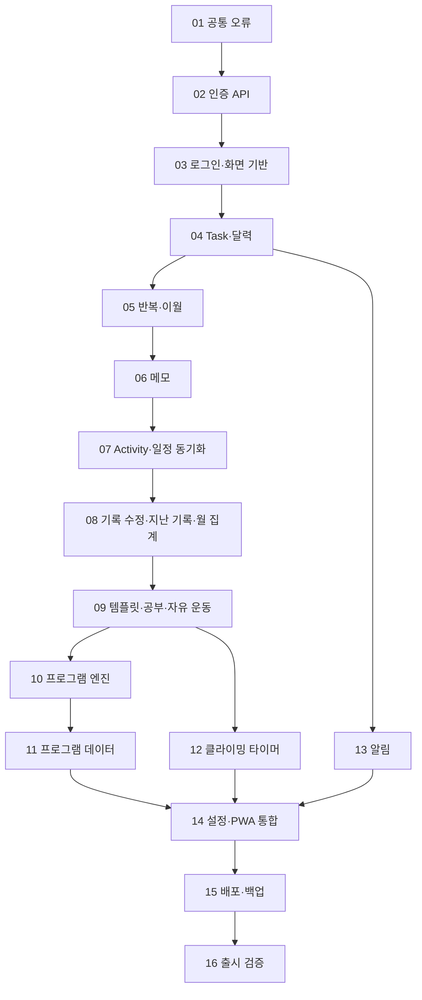

# 토도록 기능 구현 상세계획

**목표:** 로그인부터 달력·할 일·활동 기록·타이머·알림까지 실제 저장과 복구가 연결되는 MVP를 완성한다.

**구조:** planner가 인증·일정을, activity가 수행 기록·템플릿·프로그램을, notification이 알림을 소유한다. 각 기능은 계약 → 저장·규칙 → API → 화면 → 실제 왕복 테스트 순서로 완성한다. 기존 outbox·inbox·migration·생성기를 재사용한다.

**기술:** Java 25, Spring Boot 4.1.1, Gradle 9.7.1, PostgreSQL 17.11, Kafka 4.3.1, React 19.2, TypeScript, Vite 8, Node.js 24, pnpm 11.24.0.

**기준:** `docs/PRD.md` 1.4.2, `DESIGN.md` 1.2.19, `docs/ISSUE_ROADMAP.md`, develop `5eea3c16a309c1828483d8c0bd627d4585d4b145`.

**상태:** 구현 착수용 계획. 체크되지 않은 항목은 구현 완료를 뜻하지 않는다. 아래 신규 파일명과 신규 계약은 구현 제안이며 기존 API와 구분한다.

## 1. 범위와 작업 규칙

- 메인: `C:\workspace\todorok`. 격리 작업은 `C:\workspace\todorok-worktrees\<name>`에서 한다.
- 기존 기술 결정은 `docs/plans/2026-09-01-mvp-implementation-plan.md`를 참조하고, 남은 작업의 순서·분할·완료 조건은 이 문서를 따른다.
- T1 계약, T3 persistence, T4 messaging 및 재검토 보완은 완료된 기반이다. 다시 구현하지 않는다.
- 업무 API·React 기능 화면은 아직 완성되지 않았다. 생성된 interface와 HTML 시안은 실제 기능 완료로 세지 않는다.
- 날짜는 `Asia/Seoul`, date-only는 `YYYY-MM-DD` 문자열, 시각은 offset을 가진 timestamp로 전송한다.
- 인증·DB 소유권은 요청 body의 사용자 ID가 아닌 검증된 principal로 결정한다.
- JPA entity를 응답으로 반환하지 않고, 적용된 Flyway migration을 수정하지 않는다. 아래 migration 번호는 실행 시 서비스별 마지막 번호 이후로 할당한다.
- 공유 패키지에 DOM·브라우저 전역 객체를 넣지 않는다. 서버 상태는 TanStack Query, 화면 상태는 React state·Context를 쓴다.
- 일반 완료·건너뜀은 reopen, 활동 완료 취소는 void로 처리한다. outbox·inbox는 자동 삭제하지 않는다.
- 오프라인 캐시·재전송 queue·공개 회원가입·사용자별 시간대·자정 이월은 범위 밖이다.
- 한 기능 이슈에 한 PR을 대응한다. 큰 기능은 하위 이슈로 나누며 일부 구현만으로 상위 이슈를 닫지 않는다. 원격 이슈 생성·push·merge·배포는 이 문서 작성에 포함하지 않는다.
- 작업별로 회귀 테스트 작성 → 실패 확인 → 최소 구현 → 테스트·diff 검토 → 문서 상태 갱신 순서를 따른다. 변경한 파일만 작은 단위로 커밋하고 develop에는 직접 커밋하지 않는다.

## 2. 완료 지점과 의존성



| 완료 지점 | 포함 작업 | 사용자가 할 수 있는 일 |
|---|---|---|
| M1 | 01–04 | 로그인하고 날짜별 일반 할 일을 만들고 완료 |
| M2 | 05–06 | 반복 일정·이월·건너뜀·날짜별 메모로 일상 사용 |
| M3 | 07–09 | 운동·공부·클라이밍 기록 저장, 취소·수정·지난 기록·월 요약 |
| M4 | 10–12 | 프로그램 수행·진급, 클라이밍 타이머와 부분 기록 |
| M5 | 13–16 | 알림·홈 화면 설치·백업 복구가 검증된 운영 |

기본 실행은 표 순서대로 한다. 11의 데이터 이용 범위 확인이 지연돼도 합성 fixture로 엔진 검증을 마치고 12–14를 진행할 수 있다. 실제 데이터를 공개하는 완료 조건은 별도 유지한다.

## 3. 먼저 확정할 계약 보완

새 endpoint 경로는 아래 작업에서 OpenAPI 원본에 먼저 추가하고 생성물은 생성기로만 갱신한다.

| 계약 | 현재 상태 | 담당 작업·제안 |
|---|---|---|
| 오류 | 공통 schema 있음, runtime 없음 | 01에서 예외·보안 filter 응답 통일 |
| 인증 | login·refresh·logout 있음 | 02에서 cookie·오류·프로필/설정 계약 보완 |
| Task | 생성·수정·삭제·complete·reopen 있음 | 04–05에서 상세·skip·series·rollover command 추가 |
| 메모 | 별도 저장 계약 없음 | 06에서 사용자·날짜·version 기반 PATCH 추가 |
| Activity | 생성·목록·상세·void 있음 | 07–08에서 유형별 detail·수정·동기화 상태 추가 |
| 이벤트 | 핵심 4종 구현 | 실제 producer가 필요한 correction·프로그램 요청·알림 계약만 작업별 추가 |
| 월별 집계 | 없음 | 08에서 월·유형·완료·시간·등록 기준 명세화 |
| 템플릿·프로그램·알림 | 기능 계약 없음 | 09–13에서 각 서비스 소유 API와 event 정의 |

구현 전에 정리할 문서 모순도 작업에 포함한다. PRD AC-3의 ‘오늘 반복 Task 자동 생성’은 §10.4 조건표를 참조하도록 05에서 정정한다. PRD의 Connect heap 예산과 실제 조정값 차이는 15에서 최대 예산과 실제 설정을 구분한다.

## 4. 작업별 상세

아래 파일 경로는 저장소 기준이다. Java 기능 코드는 `services/<service>/src/main/java/io/todorok/<domain>/` 아래 기능별 패키지로 묶고, 같은 패키지의 `src/test/java`에 테스트를 둔다. 새 라이브러리를 추가하면 `settings.gradle.kts`, 해당 `build.gradle.kts`, 소비 서비스 의존성을 함께 변경한다.

### 01. 공통 오류·trace ID — T2 / #18 후속

**파일:** 신규 `libs/web-support/build.gradle.kts`; `libs/web-support/src/main/java/io/todorok/web/{TraceIdFilter,ApiFailure,ProblemResponseFactory,GlobalExceptionHandler}.java`; 같은 경로의 테스트. 수정 `settings.gradle.kts`, 세 서비스 `build.gradle.kts`, 세 서비스의 신규 `config/WebSupportConfiguration.java`, `packages/api-client/src/{problem,transport}.ts`, `contracts/openapi/common-v1.yaml`.

**인터페이스:** `ApiFailure(HttpStatus status, String code, boolean retryable)`; `ProblemResponseFactory`는 HTTP status·안전한 공개 설명·traceId·fieldErrors를 받아 공통 ProblemDetail을 만든다. `problem.ts`는 unknown JSON을 검사해 정상 오류와 해석 불가능한 응답을 구분한다. 내부 exception message를 공개 설명으로 쓰지 않는다.

- [ ] 잘못된 JSON 400, validation 400, 없는 경로 404, version 충돌 409, 업무 규칙 422, 일시 인프라 실패 503, 예기치 않은 오류 500 테스트를 작성한다.
- [ ] 보안 이전인 이 단계에서는 factory의 401·403 직렬화만 검증하고 실제 filter-chain 검증은 02에서 연결한다.
- [ ] 요청마다 서버가 trace ID를 생성하고 응답 `X-Trace-Id`, ProblemDetail, MDC에 동일하게 넣는다. 외부 값은 그대로 신뢰하지 않는다. filter 종료 시 MDC를 정리한다.
- [ ] `application/problem+json`, `code`, `traceId`, `retryable`과 fieldErrors 구조를 원본 schema로 검증한다. HTML 오류·stack trace·SQL·token이 응답에 섞이지 않는지 확인한다.
- [ ] 브라우저의 network 실패·비JSON 실패·정상 ProblemDetails를 분리한다. 업무 POST를 자동 재시도하지 않는다.
- [ ] `node scripts/check-contract-drift.mjs`와 새 라이브러리·서비스 오류 테스트를 실행한다.

**완료:** 세 서비스의 HTTP 오류 shape가 같고 사용자가 전달한 trace ID로 로그를 찾을 수 있다. Kafka trace 전파는 기존 envelope에 필드를 임의 추가하지 않고 별도 계약 변경이 있을 때 처리한다.

### 02. 인증·bootstrap·회전형 session — T5 / #2

**파일:** planner 신규 `auth/{UserAccount,RefreshSession,AuthService,AuthController,BootstrapCommand}.java`, 세 서비스 `security/SecurityConfiguration.java`; planner 신규 `src/main/resources/db/migration/V3__add_authentication.sql`(현재 마지막 V2); `contracts/openapi/planner-v1.yaml`; `infra/nginx/nginx.conf`의 인증 경로 요청 제한.

**입출력:** 기존 `login`, `refreshSession`, `logout` 생성 interface를 구현한다. access 유효기간 10분, refresh 30일; DB에는 refresh 해시·family·만료·사용/폐기 상태를 둔다. user ID는 UUID principal로 전달한다.

- [ ] bootstrap 두 번 실행해도 사용자 추가가 안 되는 테스트, 비밀번호 해시 검증, login 실패 공통 응답 테스트를 작성한다.
- [ ] RSA 서명·공개키 검증, issuer·audience·expiry·허용 algorithm을 검증한다. 비밀키는 환경/secret mount로 받고 저장소에 넣지 않는다.
- [ ] refresh를 트랜잭션과 행 잠금으로 한 번만 소비한다. 사용된 token 재전달은 session family 전체 폐기; 동시 두 요청·만료·로그아웃을 DB 통합 테스트한다.
- [ ] HttpOnly·Secure·SameSite=Lax cookie의 발급·회전·삭제에서 Path/속성을 일치시킨다. local 개발에서만 별도 cookie 정책을 명시한다.
- [ ] cookie 인증을 쓰는 refresh/login 요청의 Origin 검증과 CSRF 정책을 구현한다. 전역 CSRF 해제를 기본값으로 두지 않는다.
- [ ] 인증 실패 401·권한 실패 403을 01 factory로 연결한다. 타 사용자 데이터는 이후 owner-scoped 조회에서 404로 처리한다.
- [ ] 잘못된 서명·만료·다른 audience·비허용 Origin·재사용·동시 refresh·logout 이후 refresh 실패를 검증한다. 로그인 시도 제한과 429도 계약에 추가한다.

**완료:** 실제 DB 계정으로 로그인·갱신·로그아웃하고 activity/notification이 공개키만으로 JWT를 검증한다. 최초 계정 생성 HTTP endpoint는 공개하지 않는다.

### 03. 로그인 화면·routing·Query 기반 — T5·T13 / #2·#13

**파일:** 수정 `apps/web/src/{App,main}.tsx`, `apps/web/package.json`; 신규 `apps/web/src/app/{router,query-client}.tsx`, `features/auth/{AuthProvider,LoginPage}.tsx`, `packages/api-client/src/session.ts`, `apps/web/src/features/settings/ThemeProvider.tsx`.

- [ ] React Router·TanStack Query를 프로젝트 호환 버전으로 설치하고 lockfile을 갱신한다. 보호 route와 lazy domain route를 분리한다.
- [ ] access token은 메모리에만 저장하고 새로고침 시 refresh cookie로 세션을 복원한다. 복원 실패는 로그인 화면으로 보낸다.
- [ ] 동시 401은 한 refresh promise로 모은다. 탭 간 refresh 충돌은 브라우저 lock으로 직렬화하고 lock 안에서 다른 탭의 갱신 결과를 확인한다. 저장소에 token을 쓰지 않는다.
- [ ] 갱신 후 인증 실패한 요청만 1회 재전송한다. 서버가 이미 수락했을 수 있는 network 실패 POST는 재전송하지 않는다.
- [ ] logout·사용자 전환 시 Query cache를 비우고 진행 중 요청을 취소한다. localStorage·로그에 access/refresh가 없는지 검증한다.
- [ ] 로그인 성공 → 오늘 route, 재접속 → 실제 오늘, 실패 → 입력 보존·오류 표시를 component 테스트한다.

**완료:** 실제 로그인 화면에서 API를 사용한다. T13의 routing·query 기반은 여기서 완료하고 bundle·PWA 최종 검증은 14에서 한다.

### 04. 일반 Task·달력·오늘 화면 — T6 일부·T7 / #3

**파일:** planner 신규 `task/{Task,TaskRepository,TaskService,TaskController}.java`, `calendar/{CalendarQueryService,CalendarController}.java`; 신규 migration; `apps/web/src/features/today/{TodayPage,WeekCalendar,MonthCalendar,TaskGroups,QuickAdd}.tsx`; `packages/client-domain/src/calendar.ts`.

**입출력:** 기존 create/update/delete/complete/reopen와 calendar/day API를 구현한다. 상세 GET을 원본 계약에 추가한다. `(userId, scheduledDate)` index, optimistic version을 사용한다. Task 저장과 `OutboxEventWriter.append`는 같은 트랜잭션이다.

- [ ] 생성·수정·일반 완료·reopen·soft delete·version 충돌·타 사용자 접근 테스트를 작성한다. 기록형 Task는 일반 complete로 완료할 수 없다.
- [ ] 달력 조회는 최대 42일, 날짜별 네 카테고리의 total/completed를 반환한다. 빈 날짜·빈 그룹도 안정적인 형태로 반환한다.
- [ ] 선택 날짜 detail과 range summary를 별도 Query key로 두고 변경 후 관련 날짜/range만 무효화한다.
- [ ] DESIGN의 주차+날짜 8열 정렬, 주간 7일 이동, 월간 1개월 이동, 월 기준 주차, 날짜만 선택 강조를 구현한다.
- [ ] 390/420/820/1440px과 라이트·다크를 검증한다. 390px보다 좁아 44px 열을 담지 못하면 달력 내부 가로 스크롤로 터치 면적을 유지하고 페이지 전체 overflow는 막는다.
- [ ] 빠른 추가·체크·실패 복구·날짜 이동·새 세션 오늘 복귀 E2E를 실제 API와 실행한다.

**완료:** M1. 일반 할 일의 생성부터 재접속 후 조회까지 실제 저장된다. 일정 100개/1,000개에서 달력 query 수가 항목 수에 비례해 늘지 않는다.

### 05. series·반복·이월·skip — T6 / #4

**파일:** planner 신규 `series/{TaskSeries,RecurrenceRule,NextOccurrencePolicy,SeriesService}.java`, `task/RolloverService.java`; planner 계약·migration; `packages/client-domain/src/recurrence.ts`; `apps/web/src/features/today/RepeatOptions.tsx`.

- [ ] PRD AC-3를 §10.4 조건표와 일치시키고 날짜 계산 fixture를 만든다: 월말 31일, 윤년 2월, 주 경계, 종료일, interval, 기존 미래 회차.
- [ ] 없는 월 일자는 해당 월을 건너뛰는 안을 계약에 명시한다. 일회성·일/주/월 반복을 구분하고 날짜 anchor를 이월된 날짜로 덮어쓰지 않는다.
- [ ] series당 PLANNED 하나를 partial unique index로 강제한다. 동시 완료·이월·reopen의 잠금 순서를 통일한다.
- [ ] skip·series archive·명시적 rollover command를 추가한다. GET 자체로 변경하지 않고 오늘 화면 진입 시 command 성공 뒤 query한다.
- [ ] 이월은 같은 Task의 날짜만 바꾸고 event를 발행한다. 완료·SKIPPED·DELETED는 이월하지 않는다.
- [ ] reopen 시 이미 다음 활성 회차가 있으면 충돌 409로 처리하는 제안을 명세에 남긴다. 활동 void의 후속 회차 조정은 08 정책을 적용한다.
- [ ] 반복 규칙과 §10.4의 네 분기, 동일 command 재시도, 두 동시 요청을 테스트한다.

**완료:** 반복·이월 규칙의 branch 100%, 중복 활성 Task 0건. 지난 Activity 저장을 연결하는 테스트는 08에서 추가한다.

### 06. 세 종류 메모 — T7 / #5

**파일:** planner 신규 `note/{DailyNote,DailyNoteRepository,DailyNoteController}.java`; migration·planner 계약; `apps/web/src/features/today/StickyNote.tsx`; `packages/validation/src/note.ts`.

- [ ] `(user_id,date)` unique와 version을 저장한다. Task 메모는 Task/series에, 완료 메모는 07 Activity에 귀속시키고 서로 복사하지 않는다.
- [ ] 빈 메모·20,000자·20,001자·없는 날짜 최초 저장·동시 최초 저장·version 충돌을 테스트한다.
- [ ] 500ms debounce PATCH와 저장 중/저장됨/실패를 구현한다. 날짜를 바꿔도 이전 날짜 요청이 새 날짜 내용을 덮지 않도록 요청마다 날짜와 revision을 캡처한다.
- [ ] 늦게 도착한 응답은 더 최신 입력을 ‘저장됨’으로 표시하지 않는다. 충돌은 초안 보존·수동 재시도로 처리하고 queue나 자동 병합을 넣지 않는다.

**완료:** M2. 재접속해도 날짜별 메모가 유지되고 네트워크 오류에서 입력을 잃지 않는다.

### 07. Activity 저장·Task projection·완료 동기화 — T8 / #6

**파일:** activity 신규 `record/{ActivityRecord,ActivityService,ActivityController}.java`, `projection/{TaskReference,TaskEventConsumer}.java`; planner 신규 `task/ActivityEventConsumer.java`; 양쪽 migration; activity 계약; `apps/web/src/features/activity/{RecordPage,SyncStatus}.tsx`.

**입출력:** Task event → activity reference; `createActivity` → header/detail/outbox; `ActivityCompleted` → planner 완료. `InboxEventGuard.claim`과 결과 저장은 같은 transaction이다.

- [ ] TaskScheduled/Changed의 중복·낮은 version·동일 version·삭제 tombstone을 테스트한다. event 도착 순서를 가정하지 않는다.
- [ ] projection 없음은 retryable 409, 소유자/유형 불일치와 삭제 Task는 거부한다. eventual consistency의 동시 삭제 가능성은 planner consumer에서도 검증하고 reconciliation 상태로 드러낸다.
- [ ] `(userId,commandId)` unique와 요청 fingerprint로 동일 재시도는 같은 응답, 다른 payload 재사용은 409로 처리한다. header·detail·outbox를 원자 저장한다.
- [ ] 완료 기록이 같은 Task에 중복 연결되지 않게 서버 제약을 둔다. PARTIAL은 완료 event와 다음 회차를 만들지 않는다.
- [ ] 화면 취소는 Task를 유지하고 저장 성공 시 오늘로 돌아가 ‘반영 중’을 표시한다. planner 반영 실패는 ‘기록됨 · 일정 반영 재시도’로 구분한다.
- [ ] 성공 응답 유실 후 같은 commandId 재시도, consumer 중단/복구, inbox 중복, 다른 사용자 event를 통합 테스트한다.

**완료:** Activity 저장과 Task 완료가 실제 Kafka를 통해 연결된다. UI 재시도는 새 Activity를 만들지 않는다.

### 08. void·correction·지난 기록·월별 집계 — T8 / #4·#6

**파일:** activity 신규 `record/{ActivityRevisionService,MonthlySummaryQuery}.java`; planner 신규 `series/ActivityReconciliationService.java`; `contracts/events/activity-corrected/v1.schema.json` 및 fixture/Java record; `apps/web/src/features/activity/{HistoryPage,MonthlyOverview,PastRecordPage}.tsx`.

- [ ] PATCH Activity와 revision/expectedVersion, ActivityCorrected 계약을 추가한다. 최신 값·이력·event를 같은 transaction으로 저장한다.
- [ ] void는 기존 Activity를 보존한다. 후속 PLANNED 회차만 재계산 대상으로 삼고 이미 수행된 회차는 삭제하지 않는다. 재계산 불가능한 충돌은 명시적으로 표시한다.
- [ ] 지난 기록은 날짜 → Task/루틴 → 기존 폼으로 연결한다. 날짜와 원본 Task 관계를 검증하고 §10.4의 기존 활성·종료·과거/미래 다음 회차 규칙을 적용한다.
- [ ] 집계 제안을 PRD·OpenAPI에 먼저 기록한다: 완료=선택 수행월 COMPLETED 건수, 시간=선택 수행월 COMPLETED/PARTIAL의 입력된 실제 시간 합계, 등록=선택 예정월의 DELETED 제외 Task 수. VOIDED 제외, 미입력 시간은 추정하지 않는다.
- [ ] Activity에서 planner DB를 읽지 않는다. 등록 수는 planner summary, 완료/시간은 activity summary로 가져와 화면에서 조합한다. 두 응답의 기간/유형을 일치시키고 부분 실패는 0으로 위장하지 않는다.
- [ ] 수정·void 후 일별/월별 캐시 갱신, 월 경계·날짜 변경·미래 월 거부·없는 시간·부분 기록·재전달을 테스트한다.

**완료:** 저장·취소·수정·지난 기록 이후 달력과 월 집계가 일치한다. 위 집계 정의는 기존 문서에 없던 제안이므로 코드 전 문서 변경 diff에서 확인한다.

### 09. 템플릿·공부·자유 운동/클라이밍 — T9 / #7 및 #6 후속

**파일:** activity 신규 `template/{RecordTemplate,TemplateVersion,FieldDefinition,TemplateService}.java`, `study/StudyDetail.java`, `workout/WorkoutSet.java`, `climbing/ClimbingDetail.java`; `packages/validation/src/record-fields.ts`; `apps/web/src/features/templates/{TemplateEditor,RecordFields}.tsx`.

- [ ] 숫자·시간·짧은 텍스트·체크·긴 메모 field와 단위·순서를 계약에 정의한다. 도메인 discriminator로 공부/자유 운동/자유 클라이밍 정의를 분리한다.
- [ ] template 변경은 새 version, archive는 신규 선택만 차단한다. 과거 기록에 이름·형식·단위·순서 snapshot을 보존한다.
- [ ] 필드 개수에 제품 상한을 추가하지 않는다. 전체 request 크기 제한은 별도 전송 제약으로 문서화한다.
- [ ] 입력하지 않은 field는 저장하지 않고 0·false와 구별한다. 다른 template field ID·잘못된 타입·음수 시간·중복 ID를 거부한다.
- [ ] 운동 세트·클라이밍 라운드는 관계형으로, 공부 자유 값/snapshot은 JSONB로 저장한다. 임의 데이터 전체를 무검증 detail JSON에 넣지 않는다.
- [ ] 카테고리 편집 → 일정 추가 → 기록 → 템플릿 변경 → 과거 기록 표시 E2E를 실행한다.

**완료:** M3. 네 유형 Task와 세 도메인 기록이 연결되고 과거 템플릿 변경에도 기록이 유지된다.

### 10. 운동 프로그램 엔진 — T10 / #8

**파일:** activity 신규 `program/{ProgramCatalog,ProgramEnrollment,ProgramProgressPolicy,ProgramImporter}.java`; `contracts/catalog/program-v1.schema.json`; 합성 fixture; `apps/web/src/features/programs/{ProgramList,EnrollmentPage,ProgramSession}.tsx`.

- [ ] catalog key/version/checksum, 주차·세트 합계·출처·조건 schema와 importer 재실행 테스트를 작성한다.
- [ ] enrollment는 catalog version을 고정한다. 초기 검사 추천과 사용자 override를 구분해 저장한다.
- [ ] 권장량과 실제 세트를 분리한다. 성공→진급, 실패→같은 주차, void/correction→수행 이력 기반 재계산을 순수 policy로 구현한다.
- [ ] 다음 세션 요청은 event로 planner에 전달한다. enrollment/session key unique로 중복 생성을 막고 일반 반복 엔진과 역할을 분리한다.
- [ ] 활동 수정/취소 이후 이미 수행된 후속 세션을 삭제하지 않는 fixture, 동일 요청 중복, 프로그램 종료를 검증한다.

**완료:** 합성 프로그램으로 등록부터 다음 일정 생성까지 실제 왕복한다.

### 11. 푸시업·풀업 catalog — #9·#10

**파일:** 공개 저장소에는 importer 검증 테스트와 `docs/runbooks/program-catalog.md`; 실제 표는 저장소 밖 private input.

- [ ] 기존 PRD의 프로그램별 조건·회차·주의사항을 importer metadata로 연결한다.
- [ ] 이용 범위 확인 자료와 원문 version을 기록하고 private input의 checksum·주차 누락·세트 합계를 검증한다.
- [ ] 같은 key/version의 다른 checksum을 거부하고 이전 enrollment에 새 version이 적용되지 않는지 테스트한다.
- [ ] 실제 공개 권한이 확보되기 전 원문 표를 공개 fixture나 번들에 넣지 않는다.

**완료:** 사용자 데이터의 이용 범위가 확인되고 실제 importer 검증을 통과해야 완료 처리한다. 엔진 통과만으로 데이터 이슈를 닫지 않는다.

### 12. 클라이밍 타이머 — T11 / #11

**파일:** `packages/client-domain/src/timer/{state,transition}.ts`, `apps/web/src/features/climbing/{TimerPage,timer-adapters}.tsx`; activity climbing detail와 관련 계약.

**인터페이스:** `advanceTimer(state, nowMs)`는 새 상태와 이번 전환 효과를 반환한다. 상태는 PRD의 IDLE/PREPARING/WORK/REST/PAUSED/FINISHED/ABORTED를 사용한다.

- [ ] 가상 시계로 준비·10초 운동·50초 휴식·10라운드·일시정지·재개·skip·abort를 테스트한다.
- [ ] now와 deadline 차이로 phase를 복구한다. 여러 phase가 지난 경우 과거 알림을 몰아 재생하지 않는다.
- [ ] 소리·음성·진동·Wake Lock·visibility는 웹 adapter에서 처리한다. 권한 거부·API 미지원도 타이머 계산을 멈추지 않는다.
- [ ] 중단은 PARTIAL, 완료는 COMPLETED로 저장한다. 저장 실패 시 현재 화면에 결과와 같은 commandId를 유지한다.
- [ ] 500ms 이내 전환 목표, reduced motion, 실제 iPhone 백그라운드 복귀·화면 잠금·통증 중단 동작을 확인한다.

**완료:** M4. 가상 시계 branch 100%와 WebKit 통과; 실제 iPhone 결과는 별도로 기록한다.

### 13. 알림 — T12 / #12

**파일:** notification 신규 `subscription/`, `schedule/`, `delivery/` 기능 패키지와 migration; planner 신규 `notification/NotificationPreferenceController.java`; `apps/web/src/features/settings/NotificationSettings.tsx`; 필요 event schema/fixture.

- [ ] 외부 공개 API는 planner 설정/구독 접수로 두고 notification 소유 명령을 이벤트로 전달하는 안을 계약화한다. 구독 endpoint 같은 개인정보가 들어가는 event는 로그 마스킹·보존·접근 정책을 함께 명시한다.
- [ ] 알림 기본 OFF, 사용자 동작으로만 권한 요청, 요약 08시(변경 가능), 명시적 Task reminder만 생성한다.
- [ ] 22–07시 개별 알림은 만료, 요약 10시·개별 예정+30분을 deadline으로 처리한다. 재시도는 deadline을 넘기지 않는다.
- [ ] 예약 unique key·worker lease·발송 상태·재시도를 저장한다. provider 전송 성공 후 응답 유실은 서버만으로 정확히 한 번을 보장하지 못하므로 notification ID와 웹 알림 tag로 중복 표시를 줄인다.
- [ ] 만료 subscription 410·provider 429/5xx·취소/변경 이벤트·재시작·중복 event·서비스 중단 중 Task 완료를 검증한다.

**완료:** 알림 장애가 일정·기록 저장을 막지 않고 실패 원인·최종 상태가 조회된다. 실제 설치 iPhone에서 수신 확인한다.

### 14. 설정·PWA·통합 UX — T13 / #13

**파일:** `apps/web/src/features/settings/SettingsPage.tsx`, `apps/web/vite.config.ts`, `packages/design-tokens/src/index.ts`, `tests/e2e/` 신규 구성, `scripts/check-bundle-budget.mjs` 신규.

- [ ] 계정 테마 설정 API와 라이트·다크·시스템 선택을 연결한다. 설정 변경과 로그아웃·세션 만료를 실제 화면에서 검증한다.
- [ ] manifest ID·start URL·아이콘·standalone·설치 안내를 확인한다. service worker에 API 응답 캐시/오프라인 재전송을 넣지 않는다.
- [ ] 앱 재시작 시 오늘, 기록 저장 뒤 선택 과거일 유지, 월 요약 미래 제한, 도메인 820px 상한을 함께 검증한다.
- [ ] 초기 gzip 150KB·lazy chunk 100KB 예산을 CI에 연결하고 import waterfall을 확인한다.
- [ ] 최소 44px hit area, 키보드/스크린리더 이름, 오류·빈 상태·느린 응답·실패 재시도를 Chromium과 WebKit에서 검사한다.

**완료:** AC-1~7의 브라우저 경로가 자동화되고 실기기 확인이 필요한 항목은 실제 결과와 기종을 남긴다.

### 15. 배포·백업·복구 — T14 / #14

**파일:** `infra/`, `.github/workflows/`, `docs/runbooks/{deployment,backup-restore}.md` 신규.

- [ ] migration 실패 시 기존 버전을 유지하는 배포 순서를 스크립트·격리 환경에서 검증한다. OIDC·ECR·HTTPS·secret mount를 설정한다.
- [ ] 공개 80/443과 제한 관리 접속, 서비스 내부망·로그 마스킹·runtime health를 확인한다.
- [ ] 실제 Compose 메모리 값과 PRD 예산을 구분해 기록한다. 백업 암호화·주기·복구 절차를 정의한다.
- [ ] 빈 복구 환경에 DB 백업을 복원하고 사용자·Task·Activity 수와 로그인·CDC 재연결을 확인한다. 기존 운영 DB에 덮어쓰는 리허설은 하지 않는다.

**완료:** 배포 스크립트와 격리 복구 증거가 준비된다. 실제 AWS 리소스 생성·비용·운영 배포는 해당 실행 시 승인 범위를 확인한다.

### 16. 출시 판정 — T15 / #15

**파일:** `tests/` 부하·장애 시나리오와 `docs/runbooks/release-checklist.md` 신규.

- [ ] AC-1~9를 실제 API·이벤트·DB·브라우저 흐름과 대응한다.
- [ ] 4GB에서 정상 사용·DB/Kafka/Connect/consumer 중단·복구를 실행하고 p95·lag·WAL·OOM·swap을 기록한다.
- [ ] 7일 연속 관찰 후 PRD의 8GB 승급 조건을 판정한다. 짧은 smoke를 7일 검증으로 보고하지 않는다.
- [ ] macOS Safari·설치 iPhone에서 로그인·갱신·푸시·타이머·Wake Lock을 검증하고 프로그램 출처 확인 상태를 최종 점검한다.

**완료:** M5. 기능 테스트·실기기·운영 관찰·복구의 실제 증거가 모두 있어야 출시 완료로 처리한다.

## 5. 테스트 실행 방법

새 테스트 class/file은 위 작업에서 생성한다. 구현 전 명령을 실행하면 테스트가 없거나 기능 실패가 예상되며, 이를 현재 저장소 실패로 해석하지 않는다.

```powershell
# 영향 Java 모듈. 새 모듈은 작업 01에서 등록한다.
.\gradlew.bat :libs:web-support:test :services:planner-service:test --no-daemon --max-workers=1
# 영향 웹·공유 모듈
corepack pnpm test:packages
corepack pnpm test:web
# 계약을 바꾼 작업
node scripts/generate-contracts.mjs
node scripts/check-contract-drift.mjs
corepack pnpm test:contracts
# 통합 직전. 필요한 기록 정책 환경은 기존 로컬 지침을 따른다.
node scripts/verify-all.mjs
```

- 변경 규칙의 단위 테스트 → 실제 PostgreSQL 제약/동시성 → HTTP 계약 → 필요한 Kafka 왕복 → 브라우저 순서로 검증한다.
- PRD 핵심 정책은 branch 100%, 전체 line 85%·branch 80% gate를 단계적으로 연결한다. 생성물 제외 범위를 명시하고 실패 코드 제외로 숫자를 맞추지 않는다.
- E2E는 API mocking만으로 완료 판정하지 않는다. 최소 한 경로는 Nginx → service → PostgreSQL, 기록형 경로는 Kafka → planner 반영까지 포함한다.
- 기존 fresh/existing-volume Compose smoke는 migration·infra 변경 작업과 통합 gate에서 실행한다. UI 문구만 바뀐 작업에서 전체 장애 테스트를 반복하지 않는다.

## 6. 계약·수용 기준 점검표

| 기준 | 작업 | 필수 증거 |
|---|---|---|
| 오류·소유권·세션 | 01–03 | 오류 schema, 다른 사용자 접근, refresh 동시성 |
| AC-1 | 04·06 | 실제 오늘·주/월·날짜·일반 체크·메모 |
| AC-2 | 07–09 | 저장 전 미완료·저장 후 한 행·부분 실패 |
| AC-3 | 05·08 | 조건표 4분기·동시성·중복 없음 |
| AC-4 | 09 | 선택 값·version·snapshot |
| AC-5 | 10–11 | 추천 override·실패 유지·void 재계산 |
| AC-6 | 12 | phase 경계·복귀·PARTIAL |
| AC-7 | 14 | 설치·온라인 실패·수동 재시도 |
| AC-8·9 | 13 | 격리·중복 방지·만료·방해 금지 |
| 운영·성능 | 15–16 | 복구·메모리·7일·실기기 |

## 7. 착수 순서

- [ ] 작업 01의 독립 브랜치/worktree와 후속 이슈 연결을 준비한다.
- [ ] 오류 계약·trace ID runtime과 세 서비스 테스트를 완성한다.
- [ ] 작업 02→03으로 로그인까지 연결한다.
- [ ] M1·M2마다 사용 가능한 실제 화면을 확인하고 다음 작업에 진입한다.

월별 집계·없는 월 일자·reopen 충돌·알림 진입 API는 위에 제안한 의미를 코드 전 명세 변경으로 먼저 확정한다. 기존 계약 이름을 유지하고 새 DTO 이름은 해당 작업의 계약 생성 결과를 기준으로 사용한다.
